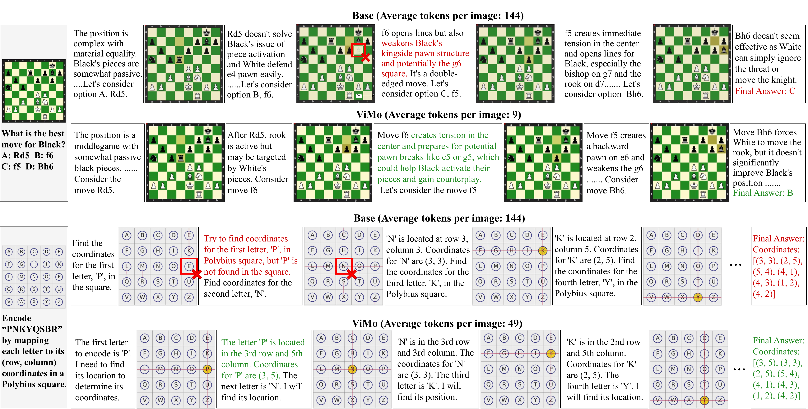

<div align="center">

# ViMo: Thinking with Visual Updates in Unified Multimodal Models

**An unified multimodal model that thinks with visual updates — modeling only the sparse visual changes across reasoning steps instead of regenerating full images.**

[]()
[](https://huggingface.co/dle666/ViMo-2B/tree/main)
[](https://www.modelscope.cn/models/wpj2003/ViMo-2B)
[](https://www.modelscope.cn/datasets/wpj2003/StructCoT)
[]()
[](http://vlrlabmonkey.xyz:10088/)

</div>

---

## News

* ```2026.06.22 ``` 🚀 We release [ViMo-2B](https://huggingface.co/dle666/ViMo-2B/tree/main), a unified multimodal model for interleaved multimodal reasoning.

## Introduction

ViMo is a unified multimodal model (UMM) that integrates multimodal understanding and generation for interleaved multimodal reasoning. It represents evolving visual states through compact **incremental visual tokens** that focus on sparse but reasoning-relevant changes across reasoning steps, reducing redundant modeling of largely unchanged visual content. Token budgets are allocated by the **TSIM Router** with temporal-similarity routing, and visual states are encoded by the **TSIM-Tok** tokenizer.

This repository releases the **ViMo-2B UMM** together with the **TSIM-Tok tokenizer**, training scripts, inference scripts, evaluation utilities, and tiny samples.

## ViMo Workflow

https://github.com/user-attachments/assets/abad70d5-1a9a-41e8-b1a0-f8f46ab89f08

## Repository Layout

```text
vimo/        ViMo model code: modeling, processing, configuration, backbone
  tsim_tok/  TSIM-Tok visual tokenizer and TSIM Router
train/       Training entry points
inference/   Inference and TSIM-Tok evaluation
scripts/     Ready-to-run scripts for ViMo, TSIM-Tok, and data utilities
configs/     Model and acceleration configs
data/        Tiny samples
docs/        Extended tutorials and README media assets
tools/       Data processing, evaluation, and inference post-processing
```

## Installation

See [INSTALL.md](INSTALL.md) for the full setup guide. Quick version:

```bash
conda create -n vimo python=3.10 -y && conda activate vimo
pip install torch torchvision --index-url https://download.pytorch.org/whl/cu121
pip install -r requirements.txt
```

### Download Checkpoints

Download our models from Huggingface.

```bash
pip install huggingface_hub

python tools/download_model.py -n ViMo-2B      # or TSIM-Tok
```

You can also download our models from ModelScope.

```bash
pip install modelscope

python tools/download_model.py -t modelscope -n ViMo-2B   # or TSIM-Tok
```

The released checkpoints are placed under `weights/`:

```text
weights/
  vimo_2b/
  tsim_tok/
    tsim_tok.pt
```

## Training and Inference

### 1. ViMo UMM

Training has two stages on top of a frozen TSIM-Tok. The basic recipe below is the simplest path for reproducing ViMo UMM training.

```bash
# Stage 1: alignment. Train the generation MLP and visual head.
# GEN_WEIGHTS_PATH defaults to weights/tsim_tok/tsim_tok.pt.
BASE_MODEL_PATH=/path/to/Qwen3-VL-2B-Instruct \
DATA_PATH=data/vimo_sft_sample.json \
bash scripts/vimo/train_vimo_stage1.sh

# Stage 2: SFT. Update all params except TSIM-Tok and the understanding MLP.
STAGE1_MODEL_PATH=./Checkpoints_MLLM/vimo_stage1/.../tfmr \
DATA_PATH=data/vimo_sft_sample.json \
bash scripts/vimo/train_vimo_stage2.sh
```

### ViMo Inference

```bash
# Pure inference for evaluation. Outputs text-only .json, then merge + extract answers.
# Zebra-CoT and StructCoT share one entrypoint; switch with JSON_PATH.
MODEL_PATH=weights/vimo_2b \
JSON_PATH=data/zebra_test_sample.json \
bash scripts/vimo/infer_vimo.sh
```

To also decode and save generated images, set `VIS_ARGS`. This streams results to `.jsonl` and skips merge/extract steps. Add `--concat_gt_images` to dump a ground-truth montage alongside each prediction.

```bash
MODEL_PATH=weights/vimo_2b \
JSON_PATH=data/zebra_test_sample.json \
VIS_ARGS="--decode_and_save_image --concat_gt_images" \
bash scripts/vimo/infer_vimo.sh
```

If samples carry precomputed `num_tokens`, the script uses them via `--use_json_num_tokens`. Otherwise set `TOKEN_ARGS="--use_tsim_router ..."` and the TSIM Router allocates incremental token budgets from temporal similarity. See [docs/data_and_token.md](docs/data_and_token.md).

### 2. TSIM-Tok Visual Tokenizer

TSIM-Tok training has two stages: single-image training, then multi-image training with variable token budgets. The visual backbone stays frozen throughout.

`BASE_MODEL_PATH` points at the Qwen3-VL-2B base directory. Its `config.json` supplies the visual `vision_config`, and its `model.safetensors` initializes the frozen visual backbone.

```bash
# Stage 1: single image.
BASE_MODEL_PATH=/path/to/Qwen3-VL-2B-Instruct \
DATA_PATH=data/tsim_tok_stage1_sample.json \
bash scripts/tsim_tok/train_tsim_tok_stage1.sh

# Stage 2: multi-image, variable-token-budget training.
BASE_MODEL_PATH=/path/to/Qwen3-VL-2B-Instruct \
VQ_CKPT=checkpoints/tsim_tok_stage1/model_dump/<ckpt>.pt \
DATA_PATHS=data/tsim_tok_stage2_sample.json \
bash scripts/tsim_tok/train_tsim_tok_stage2.sh
```

### TSIM-Tok Evaluation

Reconstruction SSIM under per-sample token budgets:

```bash
BASE_MODEL_PATH=/path/to/Qwen3-VL-2B-Instruct \
VQ_CKPT=weights/tsim_tok/tsim_tok.pt \
VAL_DATA=data/tsim_tok_stage2_sample.json \
bash scripts/tsim_tok/eval_tsim_tok.sh
```

## Documentation

- [docs/data_and_token.md](docs/data_and_token.md): dataset format and how the TSIM Router turns image similarity into token budgets.
- [docs/eval_zebra_struct.md](docs/eval_zebra_struct.md): Zebra-CoT and StructCoT scoring.
- [docs/advanced_zero3_gc.md](docs/advanced_zero3_gc.md): ZeRO-3 and gradient checkpointing.
- [docs/packing.md](docs/packing.md): sequence packing, length computation, and packing training.
- [docs/eval_vlmevalkit.md](docs/eval_vlmevalkit.md): understanding benchmarks via VLMEvalKit. This guide is still being refined.

## Qualitative Examples

<p align="center">
  
</p>

<p align="center">
  <em>Qualitative comparison of multimodal reasoning. Full-image modeling (Base) exhibits inconsistent intermediate visual states, while ViMo maintains consistent visual representations through visual updates.</em>
</p>

## Benchmark

### External Multimodal Reasoning and Understanding Evaluation

<table>
  <thead>
    <tr>
      <th>Model</th>
      <th>#Param</th>
      <th>VStar</th>
      <th>EMMA</th>
      <th>M3CoT</th>
      <th>MathVista</th>
      <th>VisuLogic</th>
      <th>MMBench</th>
      <th>MME&#8209;P</th>
      <th>MMVP</th>
    </tr>
  </thead>
  <tbody>
    <tr><td colspan="10" align="center"><strong><em>General UMMs</em></strong></td></tr>
    <tr><td>Chameleon</td><td>7B</td><td>32.5</td><td>8.6</td><td>16.1</td><td>21.7</td><td>4.5</td><td>6.0</td><td>530</td><td>4.7</td></tr>
    <tr><td>Anole</td><td>7B</td><td>34.0</td><td>6.6</td><td>15.8</td><td>22.5</td><td>3.7</td><td>6.2</td><td>508</td><td>6.7</td></tr>
    <tr><td>Janus-pro</td><td>1B</td><td>43.5</td><td>18.9</td><td>45.9</td><td>37.6</td><td>25.0</td><td>60.2</td><td>1398</td><td>39.3</td></tr>
    <tr><td>Janus-pro</td><td>7B</td><td>39.3</td><td>21.5</td><td>49.1</td><td>42.7</td><td>17.5</td><td>66.7</td><td>1509</td><td>34.7</td></tr>
    <tr><td>OmniGen2</td><td>7B</td><td>41.4</td><td>14.7</td><td>50.3</td><td>60.2</td><td>0.1</td><td>76.1</td><td>1588</td><td>35.3</td></tr>
    <tr><td>Bagel</td><td>7B</td><td>70.1</td><td>28.7</td><td>31.4</td><td>72.5</td><td>28.9</td><td>83.7</td><td>1665</td><td>69.3</td></tr>
    <tr><td>EMU3.5</td><td>34B</td><td>-</td><td>-</td><td>-</td><td>28.3</td><td>11.4</td><td>13.7</td><td>791</td><td>16.7</td></tr>
    <tr><td colspan="10" align="center"><strong><em>Understanding-centric MLLMs</em></strong></td></tr>
    <tr><td>Qwen3-VL</td><td>2B</td><td>71.7</td><td>22.2</td><td>53.0</td><td>61.1</td><td>11.5</td><td>77.1</td><td>1482</td><td>45.0</td></tr>
    <tr><td>Qwen3-VL</td><td>8B</td><td>83.7</td><td>30.6</td><td>61.2</td><td>77.6</td><td>22.5</td><td>85.2</td><td>1729</td><td>59.3</td></tr>
    <tr><td>InternVL3.5</td><td>2B</td><td>68.1</td><td>12.7</td><td>51.3</td><td>60.8</td><td>26.0</td><td>78.2</td><td>1552</td><td>48.7</td></tr>
    <tr><td>InternVL3.5</td><td>8B</td><td>69.1</td><td>16.6</td><td>59.9</td><td>74.1</td><td>29.7</td><td>82.7</td><td>1688</td><td>57.3</td></tr>
    <tr><td colspan="10" align="center"><strong><em>Latent Interleaved Reasoning Models</em></strong></td></tr>
    <tr><td>Monet</td><td>7B</td><td>79.1</td><td>22.1</td><td>44.2</td><td>62.5</td><td>10.6</td><td>75.3</td><td>1636</td><td>48.7</td></tr>
    <tr><td>Mirage</td><td>8B</td><td>13.6</td><td>13.9</td><td>1.08</td><td>29.9</td><td>0.4</td><td>12.3</td><td>549</td><td>0.0</td></tr>
    <tr><td>VPT-Det</td><td>2B</td><td>43.5</td><td>20.1</td><td>44.4</td><td>41.8</td><td>25.6</td><td>73.3</td><td>1516</td><td>34.0</td></tr>
    <tr><td colspan="10" align="center"><strong><em>Explicit Interleaved Reasoning UMMs</em></strong></td></tr>
    <tr><td>Bagel-Zebra-CoT</td><td>7B</td><td>64.9</td><td>20.6</td><td>62.6</td><td>72.1</td><td>0</td><td>55.6</td><td>1647</td><td>22.0</td></tr>
    <tr><td>ThinkMorph</td><td>7B</td><td>64.4</td><td>22.4</td><td>48.8</td><td>67.8</td><td>6.5</td><td>78.2</td><td>1478</td><td>8.6</td></tr>
    <tr><td><strong>ViMo</strong> <a href="https://huggingface.co/dle666/ViMo-2B">[Weight]</a></td><td><strong>2B</strong></td><td>75.9</td><td>28.6</td><td>54.5</td><td>69.3</td><td>23.5</td><td>82.3</td><td>1555</td><td>51.3</td></tr>
  </tbody>
</table>

VStar, EMMA, M3CoT, MathVista, and VisuLogic are grouped as multimodal reasoning benchmarks, while MMBench, MME&#8209;P, and MMVP are grouped as multimodal understanding benchmarks.

### In-domain Multimodal Reasoning Evaluation

<table>
  <thead>
    <tr>
      <th rowspan="2" align="center">Model</th>
      <th rowspan="2" align="center">#Param</th>
      <th colspan="5" align="center">Zebra-CoT</th>
      <th colspan="8" align="center">StructCoT</th>
    </tr>
    <tr>
      <th>2D</th>
      <th>3D</th>
      <th>Science</th>
      <th>Strategy</th>
      <th>Overall</th>
      <th>Strategy Planning</th>
      <th>Spatial Planning</th>
      <th>Logic</th>
      <th>Math</th>
      <th>Science</th>
      <th>Visual Search</th>
      <th>Jigsaw Restoration</th>
      <th>Overall</th>
    </tr>
  </thead>
  <tbody>
    <tr><td colspan="15" align="center"><strong><em>Understanding-centric MLLMs</em></strong></td></tr>
    <tr><td>GPT-5.2</td><td>-</td><td>67.6</td><td>19.3</td><td>73.3</td><td>54.4</td><td>53.7</td><td>43.1</td><td>33.8</td><td>42.1</td><td>76.3</td><td>50.4</td><td>87.0</td><td>57.1</td><td>55.7</td></tr>
    <tr><td>Gemini-3.1 Pro</td><td>-</td><td>68.7</td><td>19.0</td><td>83.3</td><td>60.4</td><td>57.9</td><td>71.6</td><td>28.2</td><td>50.2</td><td>78.3</td><td>55.0</td><td>79.4</td><td>65.3</td><td>61.1</td></tr>
    <tr><td>Gemini 3.0 Flash</td><td>-</td><td>66.5</td><td>19.4</td><td>78.4</td><td>54.5</td><td>54.7</td><td>55.0</td><td>33.3</td><td>44.8</td><td>74.8</td><td>48.4</td><td>83.6</td><td>64.9</td><td>57.8</td></tr>
    <tr><td>Qwen3-VL</td><td>2B</td><td>44.3</td><td>13.2</td><td>30.3</td><td>9.2</td><td>24.3</td><td>3.4</td><td>31.4</td><td>4.6</td><td>41.4</td><td>29.4</td><td>80.8</td><td>39.3</td><td>32.9</td></tr>
    <tr><td>Qwen3-VL</td><td>8B</td><td>50.7</td><td>16.9</td><td><strong>56.0</strong></td><td>22.7</td><td>36.6</td><td><strong>21.6</strong></td><td>25.4</td><td>13.1</td><td><strong>59.3</strong></td><td>39.3</td><td>83.8</td><td>46.5</td><td>41.3</td></tr>
    <tr><td>InternVL3.5</td><td>8B</td><td>29.7</td><td>11.4</td><td>48.9</td><td>19.8</td><td>27.5</td><td>6.9</td><td>36.3</td><td>17.5</td><td>36.1</td><td>32.0</td><td>75.8</td><td>41.0</td><td>35.1</td></tr>
    <tr><td>Qwen2.5-VL</td><td>72B</td><td>43.2</td><td>17.3</td><td>50.1</td><td>25.8</td><td>34.1</td><td>14.8</td><td>34.4</td><td>31.4</td><td>48.0</td><td>36.5</td><td><strong>84.9</strong></td><td>47.0</td><td>42.4</td></tr>
    <tr><td colspan="15" align="center"><strong><em>General UMMs</em></strong></td></tr>
    <tr><td>Chameleon</td><td>7B</td><td>13.3</td><td>3.0</td><td>5.2</td><td>9.9</td><td>7.9</td><td>5.6</td><td>12.5</td><td>4.1</td><td>9.1</td><td>13.1</td><td>23.5</td><td>14.4</td><td>11.8</td></tr>
    <tr><td>Anole</td><td>7B</td><td>10.8</td><td>2.8</td><td>4.8</td><td>8.5</td><td>6.7</td><td>5.4</td><td>0.1</td><td>3.8</td><td>8.9</td><td>12.8</td><td>16.8</td><td>11.4</td><td>9.9</td></tr>
    <tr><td>Janus-pro</td><td>7B</td><td>31.7</td><td>7.7</td><td>11.5</td><td>18.0</td><td>17.2</td><td>4.3</td><td>24.4</td><td>13.4</td><td>16.6</td><td>12.0</td><td>74.6</td><td>33.9</td><td>25.6</td></tr>
    <tr><td>OmniGen2</td><td>7B</td><td>26.5</td><td>1.3</td><td>9.6</td><td>9.7</td><td>11.8</td><td>0.6</td><td>25.3</td><td>1.5</td><td>8.4</td><td>10.1</td><td>78.1</td><td>28.5</td><td>21.8</td></tr>
    <tr><td>Bagel</td><td>7B</td><td>43.3</td><td>14.7</td><td>44.5</td><td>16.3</td><td>29.7</td><td>16.4</td><td>24.9</td><td>12.8</td><td>49.0</td><td>35.5</td><td>84.6</td><td>49.0</td><td>38.9</td></tr>
    <tr><td>EMU3.5</td><td>34B</td><td>10.1</td><td>3.6</td><td>8.6</td><td>11.8</td><td>8.5</td><td>2.8</td><td>29.1</td><td>4.6</td><td>19.3</td><td>15.6</td><td>21.1</td><td>18.8</td><td>15.9</td></tr>
    <tr><td colspan="15" align="center"><strong><em>Latent Interleaved Reasoning Models</em></strong></td></tr>
    <tr><td>Monet</td><td>7B</td><td>37.5</td><td>12.0</td><td>15.1</td><td>23.0</td><td>21.9</td><td>2.3</td><td>19.9</td><td>21.9</td><td>33.8</td><td>25.8</td><td>59.6</td><td>33.8</td><td>28.1</td></tr>
    <tr><td>Mirage</td><td>8B</td><td>2.2</td><td>2.5</td><td>10.7</td><td>12.4</td><td>7.0</td><td>0.9</td><td>14.3</td><td>12.4</td><td>35.8</td><td>22.5</td><td>11.0</td><td>30.4</td><td>18.2</td></tr>
    <tr><td>VPT-Det</td><td>2B</td><td>32.3</td><td>3.5</td><td>6.5</td><td>18.7</td><td>15.3</td><td>7.5</td><td>26.5</td><td>8.8</td><td>14.5</td><td>15.1</td><td>73.1</td><td>35.9</td><td>25.9</td></tr>
    <tr><td colspan="15" align="center"><strong><em>Explicit Interleaved Reasoning UMMs</em></strong></td></tr>
    <tr><td>Bagel-Zebra-CoT</td><td>7B</td><td>-</td><td>-</td><td>-</td><td>-</td><td>-</td><td>7.0</td><td>24.6</td><td>22.8</td><td>33.3</td><td>27.3</td><td>81.0</td><td>41.9</td><td>34.0</td></tr>
    <tr><td>ThinkMorph</td><td>7B</td><td>43.0</td><td>11.6</td><td>31.4</td><td>22.9</td><td>27.2</td><td>21.4</td><td>19.5</td><td>26.4</td><td>43.4</td><td>26.0</td><td>84.1</td><td>49.9</td><td>38.7</td></tr>
    <tr><td><strong>ViMo</strong> <a href="https://huggingface.co/dle666/ViMo-2B">[Weight]</a></td><td><strong>2B</strong></td><td><strong>78.9</strong></td><td><strong>20.0</strong></td><td>41.1</td><td><strong>38.3</strong></td><td><strong>44.6</strong></td><td>16.4</td><td><strong>53.0</strong></td><td><strong>66.0</strong></td><td>30.1</td><td><strong>45.6</strong></td><td>84.3</td><td><strong>62.6</strong></td><td><strong>51.1</strong></td></tr>
  </tbody>
</table>

The StructCoT test set excludes all samples originating from the Zebra-CoT dataset.

## Acknowledgements

We would like to thank [Qwen3-VL](https://github.com/QwenLM/Qwen3-VL) and [VFMTok](https://github.com/CVMI-Lab/VFMTok) for providing base models and code, as well as their contributions to this field. We also thank [Zebra-CoT](https://huggingface.co/datasets/multimodal-reasoning-lab/Zebra-CoT) for providing a valuable interleaved multimodal reasoning dataset. We also thank everyone who contributed to this open-source effort.

## Copyright

Please do not hesitate to share your valuable feedback—it is a key motivation that drives us to continuously improve our framework.

**Note:** Our model is intended for academic research and non-commercial use only. If you are interested in a faster (smaller) or stronger model, please contact us at [xbai@hust.edu.cn](mailto:xbai@hust.edu.cn) or [ylliu@hust.edu.cn](mailto:ylliu@hust.edu.cn).
