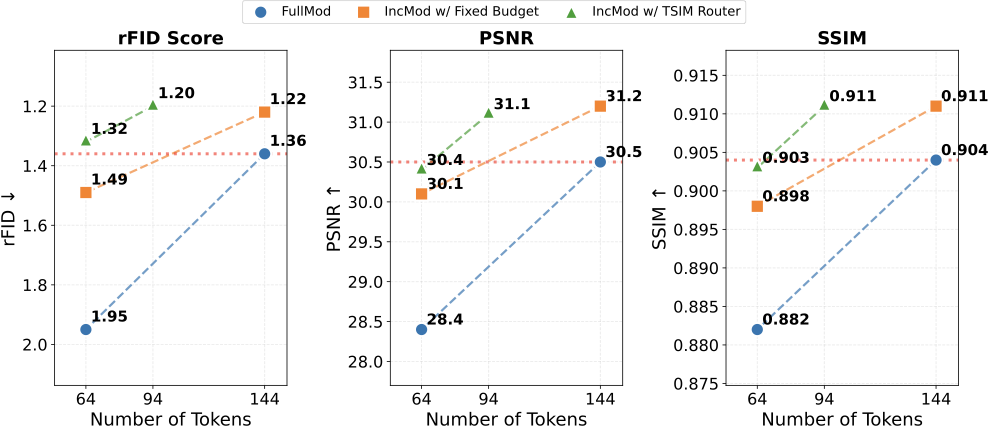

<div align="center">

# ViMo: Thinking with Visual Updates for Unified Multimodal Understanding and Generation

**A unified multimodal model that reasons through compact visual updates instead of regenerating every intermediate visual state.**

<p>
  <a href="#demo">Demo</a> |
  <a href="#installation">Installation</a> |
  <a href="#training-and-inference">Training & Inference</a> |
  <a href="#documentation">Docs</a> |
  <a href="#analysis">Analysis</a> |
  <a href="#benchmark">Benchmark</a>
</p>

</div>

---

ViMo is a unified multimodal model (UMM) for interleaved multimodal reasoning and generation. Instead of modeling every intermediate visual state as a full image, ViMo predicts only sparse **incremental visual tokens** for the parts that change between reasoning steps. Token budgets are allocated by the **TSIM Router** with temporal-similarity routing, and visual states are encoded by the **TSIM-Tok** tokenizer.

This repository releases the **2B ViMo MLLM** together with the **TSIM-Tok tokenizer**, training scripts, inference scripts, evaluation utilities, and tiny runnable samples.

## Demo

https://github.com/user-attachments/assets/c5f8c754-f59c-4bf4-9750-9be4396ee172

## Repository Layout

```text
vimo/        ViMo model code: modeling, processing, configuration, backbone, rope2d
  tsim_tok/  TSIM-Tok visual tokenizer and TSIM Router
train/       Training entry points
inference/   Inference and TSIM-Tok evaluation
scripts/     Ready-to-run scripts for ViMo, TSIM-Tok, and data utilities
configs/     Model and acceleration configs
data/        Tiny runnable samples
docs/        Extended tutorials and README media assets
tools/       Data processing, evaluation, inference post-processing, checkpoint remapping
```

## Installation

See [INSTALL.md](INSTALL.md) for the full setup guide. Quick version:

```bash
conda create -n vimo python=3.10 -y && conda activate vimo
pip install torch torchvision --index-url https://download.pytorch.org/whl/cu121
pip install -r requirements.txt
```

Put the released checkpoints under `weights/`:

```text
weights/
  vimo_2b/
  tsim_tok/
    tsim_tok.pt
```

## Training and Inference

### 1. ViMo MLLM

Training has two stages on top of a frozen TSIM-Tok. The basic recipe below is the simplest path for reproducing ViMo MLLM training.

```bash
# Stage 1: alignment. Train the generation MLP and visual head.
# GEN_WEIGHTS_PATH defaults to weights/tsim_tok/tsim_tok.pt.
BASE_MODEL_PATH=/path/to/Qwen3-VL-2B-Instruct \
DATA_PATH=data/vimo_sft_sample.json \
bash scripts/vimo/train_vimo_stage1.sh

# Stage 2: SFT. Update all params except TSIM-Tok and the understanding MLP.
STAGE1_MODEL_PATH=./Checkpoints_MLLM/vimo_stage1/.../tfmr \
DATA_PATH=data/vimo_sft_sample.json \
bash scripts/vimo/train_vimo_stage2.sh
```

### ViMo Inference

```bash
# Pure inference for evaluation. Outputs text-only .json, then merge + extract answers.
# Zebra-CoT and StructCoT share one entrypoint; switch with JSON_PATH.
MODEL_PATH=weights/vimo_2b \
JSON_PATH=data/zebra_test_sample.json \
bash scripts/vimo/infer_vimo.sh
```

To also decode and save generated images, set `VIS_ARGS`. This streams results to `.jsonl` and skips merge/extract steps. Add `--concat_gt_images` to dump a ground-truth montage alongside each prediction.

```bash
MODEL_PATH=weights/vimo_2b \
JSON_PATH=data/zebra_test_sample.json \
VIS_ARGS="--decode_and_save_image --concat_gt_images" \
bash scripts/vimo/infer_vimo.sh
```

If samples carry precomputed `num_tokens`, the script uses them via `--use_json_num_tokens`. Otherwise set `TOKEN_ARGS="--use_tsim_router ..."` and the TSIM Router allocates incremental token budgets from temporal similarity. See [docs/data_and_token.md](docs/data_and_token.md).

### 2. TSIM-Tok Visual Tokenizer

TSIM-Tok training has two stages: single-image training, then multi-image training with variable token budgets. The visual backbone stays frozen throughout.

`BASE_MODEL_PATH` points at the Qwen3-VL-2B base directory. Its `config.json` supplies the visual `vision_config`, and its `model.safetensors` initializes the frozen visual backbone.

```bash
# Stage 1: single image.
BASE_MODEL_PATH=/path/to/Qwen3-VL-2B-Instruct \
DATA_PATH=data/tsim_tok_stage1_sample.json \
bash scripts/tsim_tok/train_tsim_tok_stage1.sh

# Stage 2: multi-image, variable-token-budget training.
BASE_MODEL_PATH=/path/to/Qwen3-VL-2B-Instruct \
VQ_CKPT=checkpoints/tsim_tok_stage1/model_dump/<ckpt>.pt \
DATA_PATHS=data/tsim_tok_stage2_sample.json \
bash scripts/tsim_tok/train_tsim_tok_stage2.sh
```

### TSIM-Tok Evaluation

Reconstruction SSIM under per-sample token budgets:

```bash
BASE_MODEL_PATH=/path/to/Qwen3-VL-2B-Instruct \
VQ_CKPT=weights/tsim_tok/tsim_tok.pt \
VAL_DATA=data/tsim_tok_stage2_sample.json \
bash scripts/tsim_tok/eval_tsim_tok.sh
```

## Documentation

- [docs/data_and_token.md](docs/data_and_token.md): dataset format and how the TSIM Router turns image similarity into token budgets.
- [docs/eval_zebra_struct.md](docs/eval_zebra_struct.md): Zebra-CoT and StructCoT scoring.
- [docs/advanced_zero3_gc.md](docs/advanced_zero3_gc.md): ZeRO-3 and gradient checkpointing.
- [docs/packing.md](docs/packing.md): sequence packing, length computation, and packing training.
- [docs/eval_vlmevalkit.md](docs/eval_vlmevalkit.md): understanding benchmarks via VLMEvalKit. This guide is still being refined.

## Analysis

Compact visual updates preserve reconstruction quality with fewer visual tokens and improve downstream reasoning over full-image modeling.

<p align="center">
  
</p>

### Incremental Visual Modeling for Reasoning

Evaluated on Zebra-CoT. FullMod generates full images; IncMod predicts visual updates.

| Setting | 2D Reasoning | 3D Reasoning | Scientific Reasoning | Strategic Reasoning | Overall |
| --- | ---: | ---: | ---: | ---: | ---: |
| Text-Only | 51.2 | 64.1 | 45.0 | 40.4 | 50.1 |
| FullMod 144 | 46.6 | 59.5 | 46.1 | 40.7 | 48.2 |
| IncMod w/ Fixed Budget 144 | **51.3** | 59.7 | 45.4 | 42.0 | 49.6 |
| IncMod w/ TSIM Router 64 | 48.8 | **64.9** | **47.5** | **43.9** | **51.2** |

### Text-Only vs. ViMo Incremental Training

Same initialization, dataset, and 30K training steps.

| Setting | MMVP | MM-Vet | MathVista | ChartQA | LogicVista | BLINK | EMMA |
| --- | ---: | ---: | ---: | ---: | ---: | ---: | ---: |
| Text-Only | 0.73/0.48 | 47.3 | 66.0 | 80.4 | 35.8 | 48.9 | 23.9 |
| IncMod w/ TSIM Router | 0.73/0.48 | **51.6 (+4.3)** | **67.1 (+1.1)** | **81.2 (+0.8)** | **36.3 (+0.5)** | **52.0 (+3.1)** | **25.9 (+2.0)** |

## Benchmark

### Full Multimodal Reasoning Table

| Model | #Param | Zebra 2D | Zebra 3D | Zebra Science | Zebra Strategy | Zebra Overall | Struct Strategy | Struct Spatial | Struct Logic | Struct Math | Struct Science | Struct Visual Search | Struct Jigsaw | Struct Overall |
| --- | ---: | ---: | ---: | ---: | ---: | ---: | ---: | ---: | ---: | ---: | ---: | ---: | ---: | ---: |
| GPT-5.2 | - | 67.6 | 19.3 | 73.3 | 54.4 | 53.7 | 43.1 | 33.8 | 42.1 | 76.3 | 50.4 | 87.0 | 57.1 | 55.7 |
| Gemini-3.1 Pro | - | 68.7 | 19.0 | 83.3 | 60.4 | 57.9 | 71.6 | 28.2 | 50.2 | 78.3 | 55.0 | 79.4 | 65.3 | 61.1 |
| Gemini 3.0 Flash | - | 66.5 | 19.4 | 78.4 | 54.5 | 54.7 | 55.0 | 33.3 | 44.8 | 74.8 | 48.4 | 83.6 | 64.9 | 57.8 |
| Qwen3-VL | 2B | 44.3 | 13.2 | 30.3 | 9.2 | 24.3 | 3.4 | 31.4 | 4.6 | 41.4 | 29.4 | 80.8 | 39.3 | 32.9 |
| Qwen3-VL | 8B | 50.7 | 16.9 | **56.0** | 22.7 | 36.6 | **21.6** | 25.4 | 13.1 | **59.3** | 39.3 | 83.8 | 46.5 | 41.3 |
| InternVL3.5 | 8B | 29.7 | 11.4 | 48.9 | 19.8 | 27.5 | 6.9 | 36.3 | 17.5 | 36.1 | 32.0 | 75.8 | 41.0 | 35.1 |
| Qwen2.5-VL | 72B | 43.2 | 17.3 | 50.1 | 25.8 | 34.1 | 14.8 | 34.4 | 31.4 | 48.0 | 36.5 | **84.9** | 47.0 | 42.4 |
| Chameleon | 7B | 13.3 | 3.0 | 5.2 | 9.9 | 7.9 | 5.6 | 12.5 | 4.1 | 9.1 | 13.1 | 23.5 | 14.4 | 11.8 |
| Anole | 7B | 10.8 | 2.8 | 4.8 | 8.5 | 6.7 | 5.4 | 0.1 | 3.8 | 8.9 | 12.8 | 16.8 | 11.4 | 9.9 |
| Janus-pro | 7B | 31.7 | 7.7 | 11.5 | 18.0 | 17.2 | 4.3 | 24.4 | 13.4 | 16.6 | 12.0 | 74.6 | 33.9 | 25.6 |
| OmniGen2 | 7B | 26.5 | 1.3 | 9.6 | 9.7 | 11.8 | 0.6 | 25.3 | 1.5 | 8.4 | 10.1 | 78.1 | 28.5 | 21.8 |
| Bagel | 7B | 43.3 | 14.7 | 44.5 | 16.3 | 29.7 | 16.4 | 24.9 | 12.8 | 49.0 | 35.5 | 84.6 | 49.0 | 38.9 |
| EMU3.5 | 34B | 10.1 | 3.6 | 8.6 | 11.8 | 8.5 | 2.8 | 29.1 | 4.6 | 19.3 | 15.6 | 21.1 | 18.8 | 15.9 |
| ThinkMorph | 7B | 43.0 | 11.6 | 31.4 | 22.9 | 27.2 | 21.4 | 19.5 | 26.4 | 43.4 | 26.0 | 84.1 | 49.9 | 38.7 |
| **ViMo** | **2B** | **78.9** | **20.0** | 41.1 | **38.3** | **44.6** | 16.4 | **53.0** | **66.0** | 30.1 | **45.6** | 84.3 | **62.6** | **51.1** |

### Full Multimodal Understanding Table

| Model | #Param | VStar | EMMA | M3CoT | MME-P | MMBench | MathVista | MMVP | VisuLogic |
| --- | ---: | ---: | ---: | ---: | ---: | ---: | ---: | ---: | ---: |
| Chameleon | 7B | 32.5 | 8.6 | 16.1 | 530 | 6.0 | 21.7 | 4.7 | 4.5 |
| Anole | 7B | 34.0 | 6.6 | 15.8 | 508 | 6.2 | 22.5 | 6.7 | 3.7 |
| Janus-pro | 1B | 43.5 | 18.9 | 45.9 | 1398 | 60.2 | 37.6 | 39.3 | 25.0 |
| Janus-pro | 7B | 39.3 | 21.5 | 49.1 | 1509 | 66.7 | 42.7 | 34.7 | 17.5 |
| OmniGen2 | 7B | 41.4 | 14.7 | 50.3 | 1588 | 76.1 | 60.2 | 35.3 | 0.1 |
| Bagel | 7B | 70.1 | 28.7 | 31.4 | 1665 | 83.7 | 72.5 | 69.3 | 28.9 |
| EMU3.5 | 34B | - | - | - | 791 | 13.7 | 28.3 | 16.7 | 11.4 |
| Qwen3-VL | 2B | 71.7 | 22.2 | 53.0 | 1482 | 77.1 | 61.1 | 45.0 | 11.5 |
| Qwen3-VL | 8B | 83.7 | 30.6 | 61.2 | 1729 | 85.2 | 77.6 | 59.3 | 22.5 |
| InternVL3.5 | 2B | 68.1 | 12.7 | 51.3 | 1552 | 78.2 | 60.8 | 48.7 | 26.0 |
| InternVL3.5 | 8B | 69.1 | 16.6 | 59.9 | 1688 | 82.7 | 74.1 | 57.3 | 29.7 |
| Bagel-Zebra-CoT | 7B | 64.9 | 20.6 | 62.6 | 1647 | 55.6 | 72.1 | 22.0 | 0 |
| ThinkMorph | 7B | 64.4 | 22.4 | 48.8 | 1478 | 78.2 | 67.8 | 8.6 | 6.5 |
| **ViMo** | **2B** | 76.4 | 26.4 | 54.5 | 1555 | 82.3 | 69.3 | 51.3 | 23.5 |
